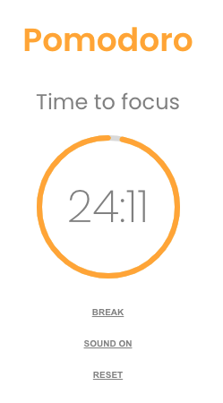

Dit project bestaat uit een 'Pomodoro-app'.

Wanneer het project gecloned is, installeer je de node_modules door het volgende commando in de terminal te runnen:

npm install

Wanneer dit klaar is, kun je de applicatie starten met behulp van:

npm start

-   De timer staat per default op 25 minuten werk-tijd en 5 minuten pauze-tijd. 
    
-   De tijd is aan te passen door op de reset-knop te drukken.

-   Met behulp van de + & - kan de tijd per categorie gewijzigd worden.

-   De timer gaat weer lopen bij het aanklikken van de 'start'-knop.

-   De timer kan op pauze gezet worden.

-   Wanneer werk-tijd overgaat in pauze-tijd en vice versa geeft de app dit aan de hand van een 
    geluid aan, het geluid kan ON & OFF.

 
